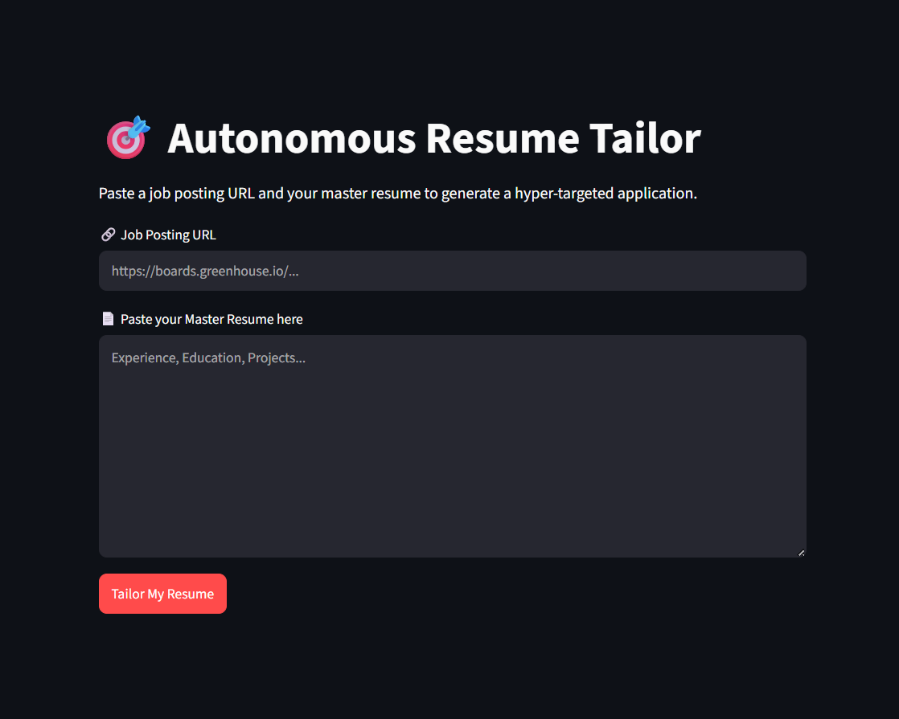

# 🎯 AI Resume Tailor Agent

An autonomous resume tailoring agent built with Python, Google Gemini (2.5 Flash), and Streamlit. This tool automates the manual effort of customizing your resume by scraping job postings, extracting key requirements, and generating a hyper-targeted resume in clean Markdown format.

## 🌐 Live Demo
**[👉 Click here to launch the AI Resume Tailor](https://sugoi-resume-tailor-agent.streamlit.app/)**

---

## 🚀 Purpose & Benefits
Applying to jobs requires highly tailored resumes to pass Applicant Tracking Systems (ATS) and catch recruiter attention. Doing this manually for every application takes hours.

*   **Hyper-Personalization:** Automatically aligns your resume bullets with the specific keywords and technical requirements of the job description.
*   **Time-Saving:** Reduces hours of manual editing to mere seconds per application.
*   **Keyword Optimization:** Uses advanced LLMs to identify the core skills that ATS software looks for.
*   **Data-Driven:** Extracts structured job data (skills, experience, responsibilities) before writing, ensuring your resume stays factual and relevant.

## 🧰 Tech Stack
* **Language:** Python 3.x
* **Framework:** Streamlit (Web UI)
* **AI/LLM:** Google GenAI SDK (Gemini 2.5 Flash)
* **Data Validation:** Pydantic
* **Web Scraping:** Requests & BeautifulSoup4

## 🛠 How It Works
The agent functions in three automated stages:
1.  **Scraping:** It navigates to the provided job URL and extracts the raw text content from the webpage.
2.  **Extraction:** Using Google Gemini's structured output capabilities (Pydantic schema), it parses the messy job text into clean, structured data (Title, Company, Core Skills, Experience, Responsibilities).
3.  **Tailoring:** It combines your "Master Resume" with the extracted job data to rewrite your resume content. It highlights the most relevant experiences for that specific role without inventing fake credentials.

---

## 💻 How to Use It (Local Setup)

If you want to run this agent on your own machine instead of using the live web version, follow these steps:

### 1. Clone the Repository
```bash
git clone [https://github.com/kislayanand1803/resume-tailor-agent.git](https://github.com/kislayanand1803/resume-tailor-agent.git)
cd resume-tailor-agent
```
### 2. Install Dependencies
```bash
pip install -r requirements.txt
```
### 3. Configure API Key
Create a .env file in the root directory of the project and add your Google AI Studio API key:
```bash
GOOGLE_GEMINI_API_KEY=your_api_key_here
GEMINI_MODEL=gemini-2.5-flash
```
### 4. Run the Application
Launch the Streamlit web interface:
```bash
streamlit run app.py
```

---

## ⚠️ Security Warning
Never commit your .env file or your API keys to GitHub. This repository includes a .gitignore file to ensure these secrets remain on your local machine. If you are deploying your own version to Streamlit Community Cloud, add your API keys via the "Advanced Settings > Secrets" menu in the Streamlit deployment dashboard.

*Built with Python, Streamlit, and the Google Gemini API.*


## 📄 License
This project is licensed under the MIT License.

---

## 🤝 Let's Connect
Created by **Kislay Anand**
* **LinkedIn:** [www.linkedin.com/in/kislay-anand-aa926332a]
